# Receiving Manager — Architecture

> **AI observes. Deterministic code decides. Evidence explains.**

This document describes the architecture of the current Receiving Manager implementation: the runtime flow, application boundaries, AI boundary, decision engine, evidence model, failure handling, data/storage boundaries, API surface, source structure, testing approach, and the main engineering trade-offs.

The design is intentionally centered on one operational question:

**Can we verify what actually arrived against what was expected, and can we show the evidence behind that decision?**

---

# 1. Architecture at a glance

Receiving Manager is a web application with four major responsibilities:

1. Establish the **expected state** from a purchase order.
2. Capture and preserve the **physical evidence** from guided receiving photos.
3. Use multimodal AI to extract **structured observations**, then use deterministic application logic to reconcile those observations against the PO.
4. Persist an **auditable evidence record** that can be reviewed, overridden, exported, and consumed by downstream systems.

The main architectural boundary is:

```text
                ┌────────────────────────────────────┐
                │            Receiving UI            │
                │     Next.js + React + TypeScript   │
                └─────────────────┬──────────────────┘
                                  │
                                  ▼
                ┌────────────────────────────────────┐
                │          Receiving API              │
                │       Next.js Route Handlers        │
                └───────────────┬────────────────────┘
                                │
             ┌──────────────────┼─────────────────────┐
             │                  │                     │
             ▼                  ▼                     ▼
      ┌────────────┐     ┌──────────────┐      ┌──────────────┐
      │ PO / Data  │     │ Evidence     │      │ Supporting   │
      │ Retrieval  │     │ Storage      │      │ Signals      │
      │            │     │              │      │ OCR/Barcode  │
      └─────┬──────┘     └──────┬───────┘      └──────┬───────┘
            │                   │                     │
            └───────────────────┼─────────────────────┘
                                ▼
                    ┌──────────────────────────┐
                    │ Gemini Multimodal Model │
                    │      Observation        │
                    └─────────────┬────────────┘
                                  │
                                  ▼
                    ┌──────────────────────────┐
                    │ Structured Vision Output │
                    │ + schema validation      │
                    └─────────────┬────────────┘
                                  │
                                  ▼
                    ┌──────────────────────────┐
                    │ Deterministic Inspection │
                    │ + Evidence Floor         │
                    │ + Reconciliation         │
                    └─────────────┬────────────┘
                                  │
                                  ▼
                    ┌──────────────────────────┐
                    │ PASS / FAIL / UNCERTAIN │
                    │ Overall outcome          │
                    └─────────────┬────────────┘
                                  │
                                  ▼
                    ┌──────────────────────────┐
                    │ Evidence Record          │
                    │ Hash + model + images    │
                    │ Overrides + audit data   │
                    └─────────────┬────────────┘
                                  │
                                  ▼
                    ┌──────────────────────────┐
                    │ Human Review / JSON API  │
                    └──────────────────────────┘
```

The model is deliberately not the final business-rule engine.

---

# 2. Primary architectural goals

The architecture is optimized around the following requirements.

## 2.1 Evidence must survive processing failures

The original receiving image is saved before optional enrichment such as OCR, barcode detection, or image-quality analysis.

```text
Select image
    ↓
Persist original evidence
    ↓
Run enrichment
    ↓
Persist enrichment metadata
```

This prevents a slow or failed enrichment step from becoming an evidence-loss event.

---

## 2.2 AI should observe, not silently invent business decisions

The multimodal model is responsible for interpreting visual evidence and producing structured observations.

Application code is responsible for:

- comparing observations with the expected PO state
- checking evidence sufficiency
- deciding PASS / FAIL / UNCERTAIN
- producing the overall receiving outcome
- creating the evidence record

This separation reduces the amount of business logic hidden inside a prompt.

---

## 2.3 Uncertainty is a real system state

The system does not treat an unclear image as a weak PASS.

The three per-check states are:

```text
PASS
FAIL
UNCERTAIN
```

`UNCERTAIN` can result from:

- missing required evidence
- ambiguous visual evidence
- unreadable labels
- insufficient quantity visibility
- conflicting supporting signals
- other conditions where a reliable decision cannot be established

---

## 2.4 A temporary service failure must not erase a receiving capture

A saved capture can remain valid even when the model service is temporarily unavailable.

```text
Capture saved
     ↓
Model call fails
     ↓
PENDING
     ↓
Retry
     ↓
Inspection resumes
```

This separates **evidence persistence** from **AI availability**.

---

## 2.5 Human review must be auditable

A reviewer can override an automated decision, but the system should preserve the original decision.

Conceptually:

```text
Original automated verdict
          +
Reviewer verdict
          +
Reason
          +
Timestamp
          ↓
Auditable override history
```

The review operation is therefore additive rather than destructive.

---

# 3. System context

At the highest level, the system sits between a receiving operator and the operational records needed to make a receiving decision.

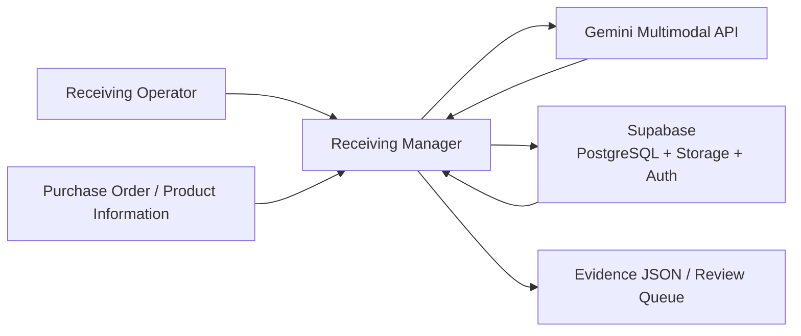

### Responsibility of each external dependency

| Dependency | Responsibility |
|---|---|
| Receiving operator | Captures evidence, initiates inspection, reviews or overrides results |
| Purchase-order data | Defines the expected state |
| Gemini | Extracts structured observations from the receiving evidence |
| Supabase PostgreSQL | Persists operational and inspection records |
| Supabase Storage | Stores original receiving images |
| Supabase Auth / RLS | Controls authenticated access and data isolation |
| Evidence/JSON output | Makes the decision consumable outside the UI |

---

# 4. Container architecture

The application can be viewed as a set of cooperating containers/modules rather than a collection of independent AI agents.

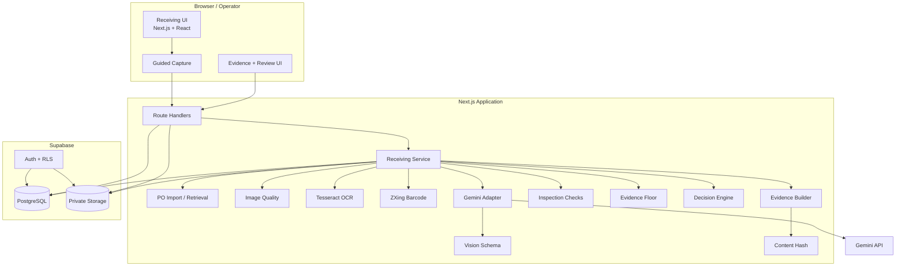

---

# 5. Layered architecture

The codebase is easiest to reason about in layers.

## Layer 1 — Presentation

Responsibilities:

- sign-in
- receiving workflow
- PO selection
- guided image capture
- inspection result display
- evidence inspection
- inspection queue
- JSON/evidence viewing
- evaluation view

Relevant application areas:

```text
src/app/(app)/
src/components/
src/app/sign-in/
```

---

## Layer 2 — HTTP/API boundary

Next.js Route Handlers expose the application operations.

Relevant routes include:

```text
src/app/api/purchase-orders/route.ts
src/app/api/purchase-orders/[id]/route.ts

src/app/api/receiving/route.ts
src/app/api/receiving/[id]/route.ts
src/app/api/receiving/[id]/images/route.ts
src/app/api/receiving/[id]/images/[imageId]/route.ts
src/app/api/receiving/[id]/inspect/route.ts
src/app/api/receiving/[id]/evidence/route.ts
src/app/api/receiving/[id]/json/route.ts
src/app/api/receiving/[id]/override/route.ts
src/app/api/receiving/[id]/retry/route.ts
```

These routes form the server-side application boundary.

---

## Layer 3 — Domain services

The domain layer contains the actual receiving workflow.

Relevant modules include:

```text
src/lib/server/receiving.ts
src/lib/inspection/checks.ts
src/lib/inspection/decision.ts
src/lib/inspection/evidence-floor.ts
src/lib/evidence/record.ts
src/lib/po/import.ts
```

These modules are where the receiving workflow becomes deterministic and testable.

---

## Layer 4 — AI and supporting perception

AI and local perception components are intentionally kept separate.

```text
src/lib/ai/
src/lib/ocr/
src/lib/barcode/
src/lib/image/
```

The AI adapter handles communication with Gemini.

OCR, barcode detection, and image-quality analysis are supporting signals and do not replace the evidence record.

---

## Layer 5 — Persistence

Supabase provides:

```text
PostgreSQL
Storage
Auth
Row-level security
```

Server-side Supabase helpers are under:

```text
src/lib/supabase/
```

The database migration is under:

```text
supabase/migrations/0001_init.sql
```

---

# 6. End-to-end runtime flow

The complete runtime flow is:

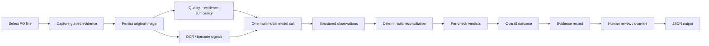

The same receiving record carries the context through the entire workflow.

---

# 7. Receiving capture architecture

Guided capture is used because different visual checks need different evidence.

Typical capture purposes include:

```text
Overview
Carton label
Quantity
Product
Optional damage evidence
```

The important distinction is not the exact number of photos; it is that every image has an intended inspection purpose.

## Capture pipeline

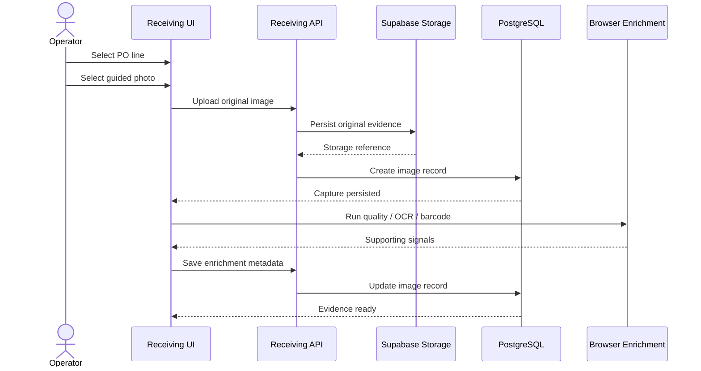

### Architectural invariant

**Save first, enrich second.**

This is one of the most important reliability decisions in the application.

---

# 8. Image-quality and evidence-sufficiency architecture

Image quality is not the same thing as evidence sufficiency.

A technically valid image can still fail to establish the required fact.

For example:

```text
Image exists
   +
Image is sharp enough
   +
Label is still visible
   =
Potentially sufficient identity evidence
```

Whereas:

```text
Image exists
   +
Image is blurry
   =
Not sufficient to establish label identity
```

The architecture therefore keeps two questions separate:

```text
Is the image usable?
        +
Does the available evidence prove the required fact?
```

The relevant modules are:

```text
src/lib/image/quality.ts
src/lib/inspection/evidence-floor.ts
```

---

# 9. AI boundary

## 9.1 One model call per receiving unit

The architecture sends the expected PO context and available receiving evidence into one multimodal inspection call for the unit.

Conceptually:

```text
PO expectation
      +
all available receiving images
      +
supporting signals
      ↓
one multimodal inspection
      ↓
structured observations
```

The system does not create a separate Gemini call for every check.

This provides a single visual context for the unit and keeps the application-level check logic centralized.

---

## 9.2 AI is an observation layer

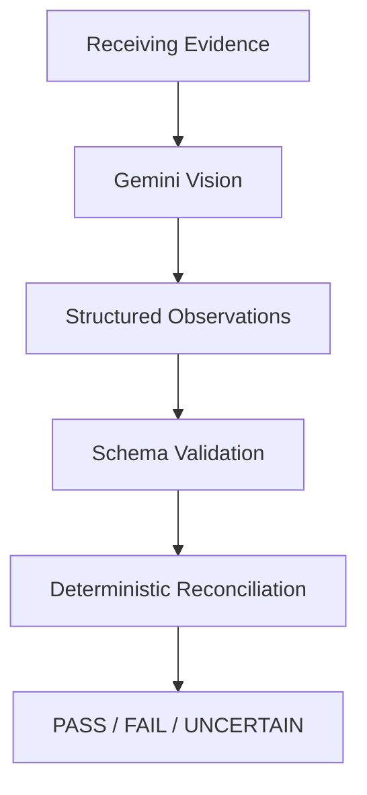

The AI layer should answer questions such as:

```text
What product appears visible?
What labels or identifiers are visible?
What quantity is visually established?
Is there visible damage?
Which evidence supports each observation?
Is the visual evidence ambiguous?
```

The application layer then decides what those observations mean against the PO.

---

## 9.3 Schema boundary

The AI response is not accepted as arbitrary free-form text.

The repository contains:

```text
src/lib/ai/vision-schema.ts
```

which provides the structured output boundary used by the inspection workflow.

The architectural objective is:

```text
Gemini response
      ↓
Structured schema
      ↓
Validated observation object
      ↓
Business logic
```

This keeps parsing concerns separate from decision logic.

---

# 10. AI prompt architecture

The receiving inspection prompt is separated from application code:

```text
src/lib/ai/prompts/receiving-inspection.ts
```

This separation is useful because the prompt describes the visual observation task while the deterministic inspection modules define the business rules.

The boundary is:

```text
Prompt
  └── asks for observations

Schema
  └── defines response shape

Checks
  └── interpret observations

Decision
  └── determines outcome

Evidence
  └── records result
```

This is intentionally different from putting the complete receiving policy into one large prompt.

---

# 11. Supporting signals: OCR and barcode

OCR and barcode detection are supporting perception tools.

```text
Tesseract.js
    ↓
OCR text signal

ZXing
    ↓
Barcode signal
```

Relevant modules:

```text
src/lib/ocr/tesseract.ts
src/lib/barcode/zxing.ts
```

They can help with:

- labels
- identifiers
- reference numbers
- barcode values

But neither should be treated as an unquestioned source of truth.

The architecture allows the image itself and the multimodal model to remain available when a supporting signal is missing.

---

# 12. Deterministic inspection architecture

After the model returns structured observations, the application performs deterministic reconciliation.

Relevant modules:

```text
src/lib/inspection/checks.ts
src/lib/inspection/decision.ts
src/lib/inspection/evidence-floor.ts
```

The conceptual pipeline is:

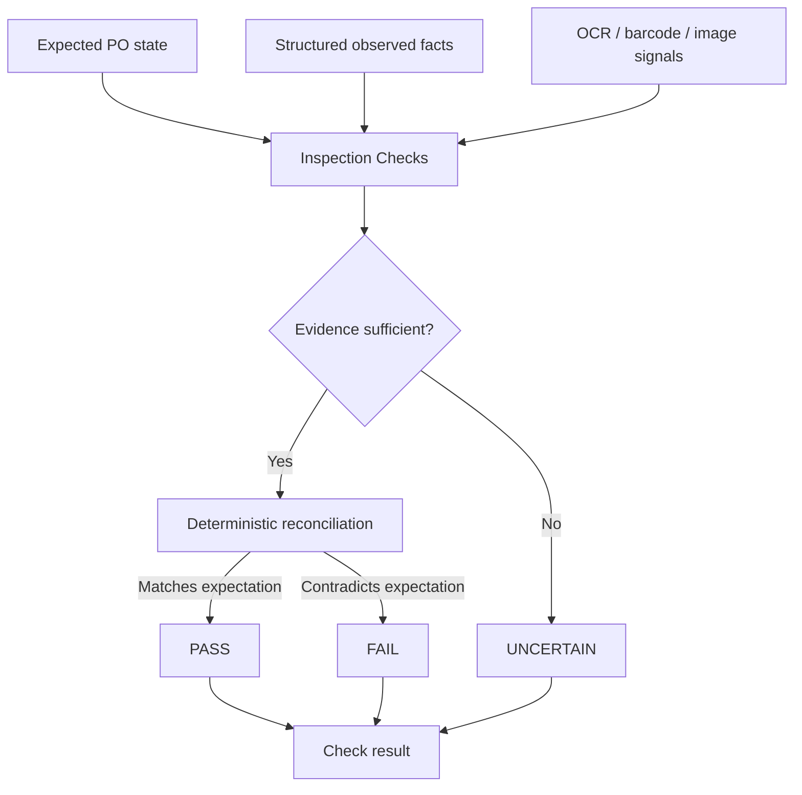

The important distinction is:

```text
FAIL       = evidence demonstrates a mismatch
UNCERTAIN  = evidence does not establish the answer
```

---

# 13. Per-check decision states

Every check should resolve to one of three states:

### PASS

The available evidence supports the expected condition.

### FAIL

The available evidence demonstrates that the expected condition is not met.

### UNCERTAIN

The available evidence is insufficient or ambiguous.

The decision model can be summarized as:

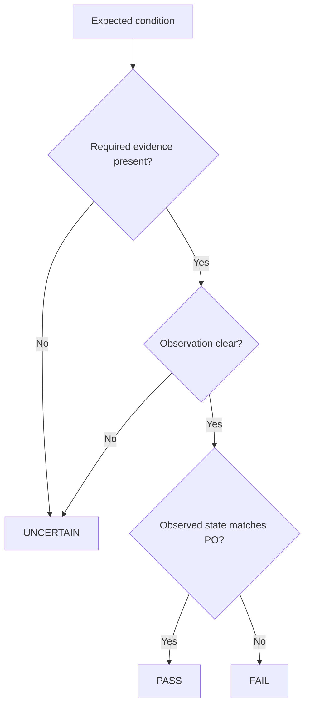

This is the central decision contract of the application.

---

# 14. Overall receiving outcome

The per-check results are rolled into an overall operational outcome.

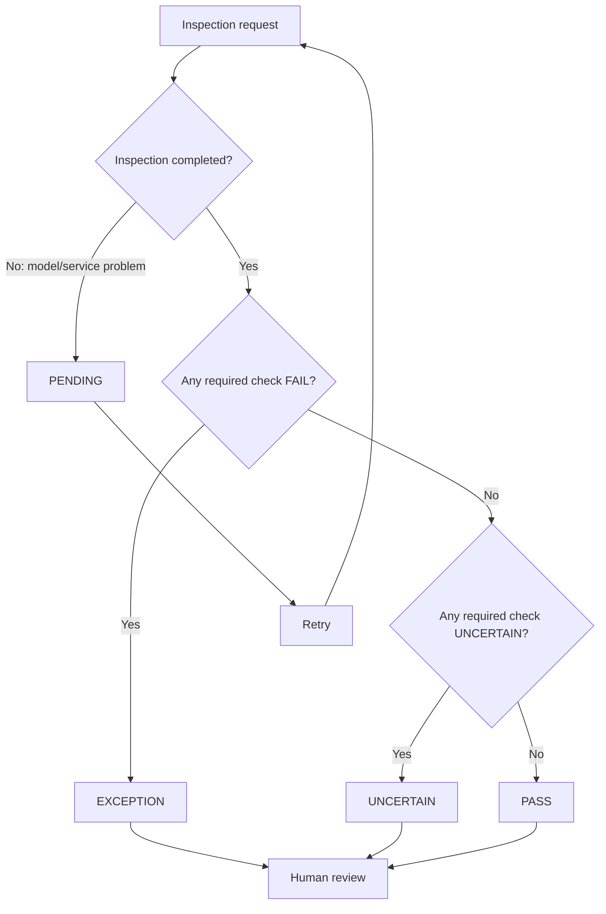

`PENDING` is an operational processing state.

`EXCEPTION` represents a receiving exception.

That distinction prevents an external model outage from being incorrectly treated as a product mismatch.

---

# 15. Evidence record architecture

The evidence record is the core audit object.

At a conceptual level:

```mermaid
flowchart TB
    R[Evidence Record]

    R --> META[Metadata]
    R --> IMAGES[Images]
    R --> CHECKS[Checks]
    R --> OUTCOME[Outcome]
    R --> OVERRIDE[Overrides]
    R --> STATUS[Processing Status]
    R --> HASH[Content Hash]

    META --> M1[record_id]
    META --> M2[schema_version]
    META --> M3[organization_id]
    META --> M4[client_id]
    META --> M5[agent]
    META --> M6[subject]
    META --> M7[captured_at]
    META --> M8[operator_label]

    IMAGES --> I1[image references]
    IMAGES --> I2[quality metadata]
    IMAGES --> I3[OCR / barcode metadata]

    CHECKS --> C1[check_key]
    CHECKS --> C2[verdict]
    CHECKS --> C3[confidence]
    CHECKS --> C4[detail]
    CHECKS --> C5[model_version]
    CHECKS --> C6[latency_ms]

    OUTCOME --> O1[PASS]
    OUTCOME --> O2[EXCEPTION]
    OUTCOME --> O3[UNCERTAIN]
    OUTCOME --> O4[PENDING]

    OVERRIDE --> V1[original verdict]
    OVERRIDE --> V2[new verdict]
    OVERRIDE --> V3[reason]
    OVERRIDE --> V4[timestamp]
```

The evidence record therefore links:

```text
Expected state
      ↓
Captured evidence
      ↓
Observed facts
      ↓
Individual checks
      ↓
Overall outcome
      ↓
Human intervention
```

---

# 16. Evidence lifecycle

```text
1. Capture
   ↓
2. Persist original image
   ↓
3. Enrich
   ↓
4. Inspect
   ↓
5. Reconcile
   ↓
6. Build evidence record
   ↓
7. Review / override
   ↓
8. Export structured JSON
```

This lifecycle is intentionally append-oriented.

The system should not need to rewrite the original image merely because the interpretation changes.

---

# 17. Content integrity

The evidence layer includes content hashing.

Conceptually:

```text
Evidence inputs
     ↓
Canonical representation
     ↓
Content hash
     ↓
Persist with evidence record
```

Relevant helper:

```text
src/lib/hash.ts
```

The role of the hash is to provide a lightweight integrity reference for the recorded evidence state.

The hash is not a replacement for access control or storage security.

---

# 18. Human review architecture

Human review sits after automated inspection.

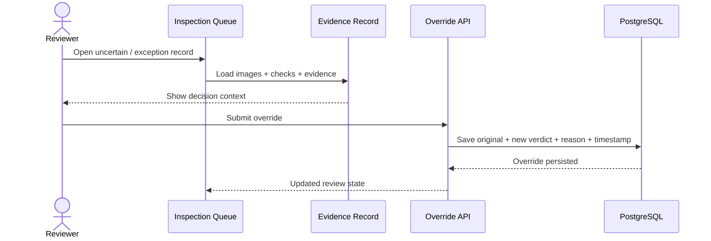

This preserves the distinction between:

```text
Automated decision
Human decision
```

rather than collapsing them into one field with no history.

---

# 19. Failure architecture

The application treats different failures differently.

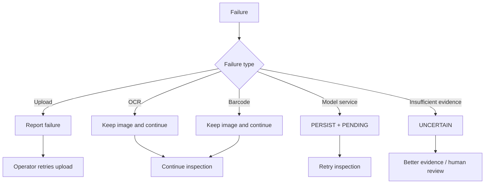

### Why this matters

There are three different classes of problems:

```text
Data loss risk
Processing degradation
Decision uncertainty
```

They should not be represented by one generic error state.

---

# 20. Retry architecture

Model availability is treated as a recoverable dependency.

```text
POST /api/receiving/[id]/inspect
               ↓
         Gemini request
               ↓
       ┌───────┴────────┐
       │                │
    Success           Failure
       │                │
       ▼                ▼
  Process result     PENDING
       │                │
       └───────┬────────┘
               ▼
      /api/receiving/[id]/retry
               ↓
          Inspect again
```

The important invariant is:

**Retrying the inspection must not require the operator to re-upload the original evidence.**

---

# 21. Data and storage architecture

The storage boundary separates structured records from binary evidence.

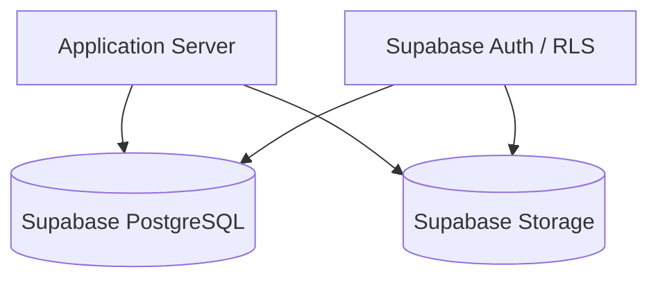

### PostgreSQL responsibility

Stores structured application and inspection state, including:

- receiving records
- PO-related records
- image metadata
- inspection results
- evidence information
- override information
- related application state

### Storage responsibility

Stores original receiving images and their storage references.

The image itself and its metadata should not be conflated.

---

# 22. Security and tenant isolation

The application includes authenticated access and organization/client scoping in its data model.

The security boundary can be thought of as:

```text
Authenticated operator
        ↓
Server-side request
        ↓
Organization / client scope
        ↓
Scoped database query
        ↓
Scoped evidence storage
```

Important design requirements include:

- API keys remain server-side
- `.env.local` is not committed
- service-role access is kept on the server
- records are scoped to the receiving context
- storage references are not treated as authorization
- RLS is part of the database access boundary
- evidence should remain private to its permitted tenant/context

Security is therefore enforced in the application and persistence layers rather than only through UI filtering.

---

# 23. API architecture

The current route surface can be grouped by responsibility.

## Purchase orders

```text
GET /api/purchase-orders
GET /api/purchase-orders/[id]
```

Responsible for retrieving the expected receiving state.

---

## Receiving records

```text
POST /api/receiving
GET /api/receiving/[id]
```

Responsible for creating and retrieving a receiving record.

---

## Images

```text
POST /api/receiving/[id]/images
PATCH /api/receiving/[id]/images/[imageId]
```

Responsible for:

- persisting original image evidence
- updating image metadata
- recording enrichment results

---

## Inspection

```text
POST /api/receiving/[id]/inspect
POST /api/receiving/[id]/retry
```

Responsible for the inspection lifecycle.

---

## Evidence

```text
GET /api/receiving/[id]/evidence
GET /api/receiving/[id]/json
```

Responsible for retrieving the evidence record and structured representation.

---

## Review

```text
POST /api/receiving/[id]/override
```

Responsible for recording auditable human intervention.

---

# 24. Request-to-record architecture

A single inspection can be traced from the first HTTP request to the final evidence record.

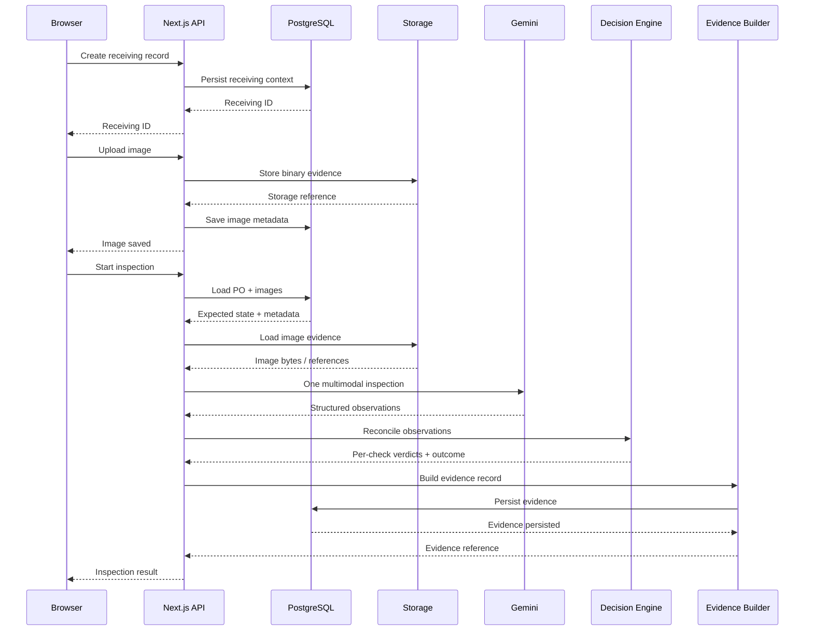

---

# 25. State model

The receiving lifecycle has operational states.

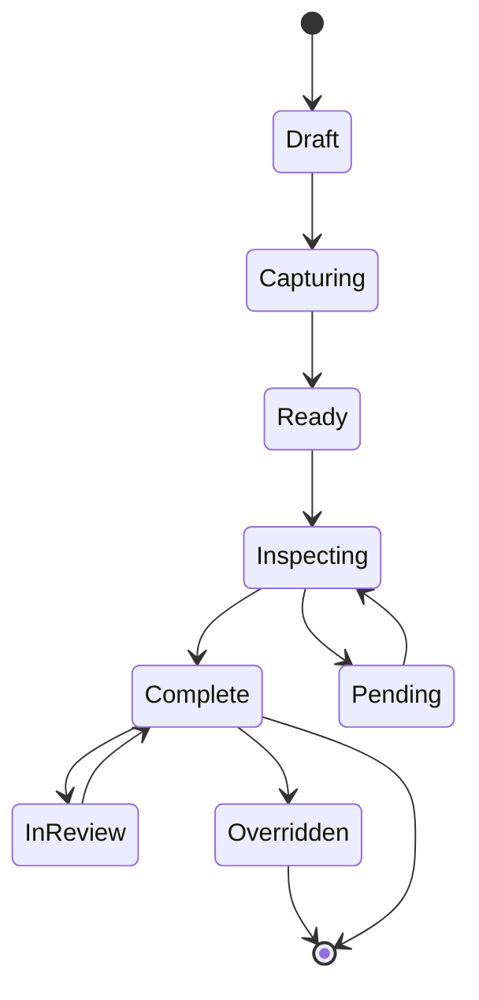

The exact UI terminology can differ from the internal persistence state, but the architecture separates:

```text
Not started
Capture in progress
Ready to inspect
Inspection in progress
Inspection complete
Pending due to recoverable processing failure
Human review
Post-review result
```

---

# 26. Decision state versus processing state

These concepts must not be mixed.

### Decision state

```text
PASS
FAIL
UNCERTAIN
```

### Overall receiving state

```text
PASS
EXCEPTION
UNCERTAIN
```

### Processing state

```text
PENDING
```

This distinction is important because:

```text
Gemini unavailable
```

does not mean:

```text
Product failed inspection
```

It means:

```text
Inspection has not yet completed.
```

---

# 27. Source-code architecture

The current source tree organizes responsibilities by domain.

```text
src/
├── app/
│   ├── (app)/
│   │   ├── evaluation/
│   │   ├── evidence/
│   │   │   └── [id]/
│   │   ├── inspection-queue/
│   │   ├── purchase-orders/
│   │   └── receiving/
│   ├── api/
│   │   ├── purchase-orders/
│   │   └── receiving/
│   ├── sign-in/
│   ├── globals.css
│   ├── layout.tsx
│   └── page.tsx
│
├── components/
│   ├── nav.tsx
│   ├── records-table.tsx
│   └── ui.tsx
│
└── lib/
    ├── ai/
    │   ├── gemini.ts
    │   ├── vision-schema.ts
    │   └── prompts/
    │       └── receiving-inspection.ts
    ├── barcode/
    │   └── zxing.ts
    ├── evidence/
    │   └── record.ts
    ├── image/
    │   └── quality.ts
    ├── inspection/
    │   ├── checks.ts
    │   ├── decision.ts
    │   └── evidence-floor.ts
    ├── ocr/
    │   └── tesseract.ts
    ├── po/
    │   └── import.ts
    ├── server/
    │   ├── api.ts
    │   └── receiving.ts
    ├── supabase/
    │   ├── admin.ts
    │   ├── client.ts
    │   └── server.ts
    ├── config.ts
    ├── hash.ts
    ├── types.ts
    └── utils.ts
```

This is intentionally a domain-oriented structure rather than a single monolithic page or a single AI prompt.

---

# 28. Important module responsibilities

| Module | Responsibility |
|---|---|
| `ai/gemini.ts` | Gemini API integration |
| `ai/vision-schema.ts` | Structured AI response boundary |
| `ai/prompts/receiving-inspection.ts` | Receiving inspection prompt |
| `barcode/zxing.ts` | Barcode supporting signal |
| `ocr/tesseract.ts` | OCR supporting signal |
| `image/quality.ts` | Image quality assessment |
| `inspection/checks.ts` | Per-check inspection logic |
| `inspection/evidence-floor.ts` | Evidence sufficiency constraints |
| `inspection/decision.ts` | Overall decision logic |
| `evidence/record.ts` | Evidence record construction |
| `hash.ts` | Content hashing |
| `po/import.ts` | PO data import/transformation |
| `server/receiving.ts` | Receiving orchestration |
| `supabase/*.ts` | Database/auth client boundaries |

---

# 29. Why the architecture is not multi-agent

The receiving problem does not need a set of independent agents negotiating with one another.

Instead, it uses a clear pipeline:

```text
Evidence
   ↓
Perception
   ↓
Structured observations
   ↓
Deterministic rules
   ↓
Evidence record
```

This has several engineering benefits:

- easier debugging
- clearer failure boundaries
- lower coordination overhead
- simpler evaluation
- easier traceability
- fewer model calls
- clearer ownership of business rules

The AI component has one well-defined job: visual observation.

---

# 30. Why deterministic logic remains outside the model

A purchase order creates explicit expectations.

For example:

```text
Expected SKU
Expected product
Expected cartons
Expected units
Expected supplier
```

The application can directly compare structured values when the observations are sufficiently established.

That logic is easier to:

- unit test
- review
- version
- debug
- evaluate

A prompt can change model behavior; deterministic application logic should remain the authoritative place for business reconciliation.

---

# 31. Evidence floor

The evidence floor is the architectural guardrail that prevents unsupported decisions.

Conceptually:

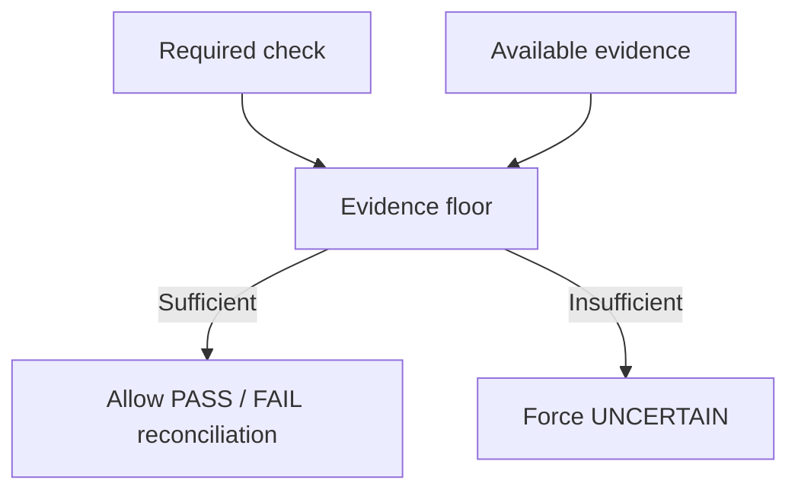

The evidence floor exists because a receiving workflow should distinguish:

```text
"I saw a mismatch."
```

from:

```text
"I could not see enough to verify it."
```

This is especially important for image-based quantity and identity checks.

---

# 32. Quantity verification architecture

Quantity is treated cautiously because a photograph does not necessarily prove the full number of units in a shipment.

The architectural concept is:

```text
Expected quantity
      +
Visible quantity evidence
      +
Coverage of the inspected scene
      ↓
Can the quantity actually be established?
      │
      ├── Yes → reconcile
      │
      └── No  → UNCERTAIN
```

The design does not infer unseen units simply because the PO says they should exist.

---

# 33. Product identity architecture

Identity should not depend on one signal alone.

Possible evidence sources include:

```text
Visual product appearance
        +
Visible label / SKU
        +
OCR text
        +
Barcode
        +
PO context
```

The architecture uses these as complementary signals.

A single missing barcode should therefore not automatically mean the product is invalid.

Likewise, a visually similar item should not be accepted solely because the surrounding context suggests the expected SKU.

---

# 34. Damage / condition architecture

Visible condition is a perception task.

The AI can report observations such as:

```text
Visible damage
Packaging condition
Broken seal
Dent / tear / deformation
Other visually apparent condition issues
```

The final check still depends on what is actually established by the evidence.

The architecture deliberately avoids pretending that unseen damage is absent.

---

# 35. Database conceptual model

The exact database schema is defined by:

```text
supabase/migrations/0001_init.sql
```

Architecturally, the data is organized around the relationship:

```text
Purchase order
      ↓
Receiving record
      ↓
Evidence images
      ↓
Inspection result
      ↓
Evidence record
      ↓
Override history
```

A reviewer should treat the migration as the source of truth for exact table names, columns, keys, constraints, and policies.

The diagram below is therefore a **conceptual relationship diagram**, not a substitute for the migration:

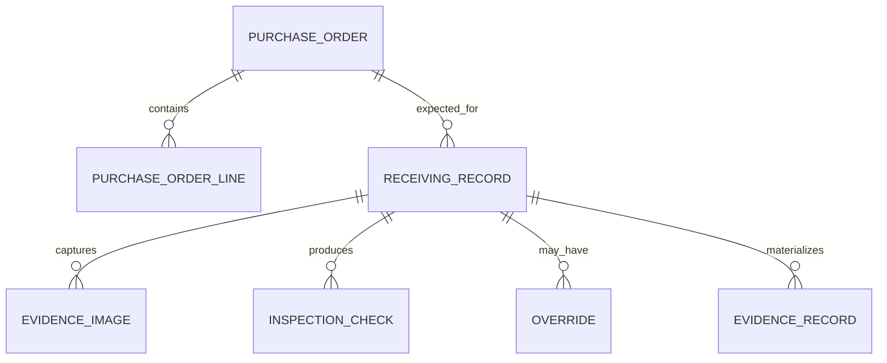

---

# 36. Persistence boundaries

The application uses separate client/server Supabase helpers.

```text
src/lib/supabase/client.ts
    ↓
browser-safe Supabase client

src/lib/supabase/server.ts
    ↓
server-side authenticated access

src/lib/supabase/admin.ts
    ↓
server-side privileged operations
```

This prevents privileged database credentials from being used directly in the browser.

---

# 37. Evaluation architecture

Evaluation is treated as a separate concern from runtime inspection.

Relevant repository areas include:

```text
evaluation/
evaluation/dataset/
evaluation/labels/
tests/
EVALUATION.md
```

Runtime system:

```text
Application
    ↓
Inspection result
```

Evaluation system:

```text
Fixtures / labelled data
    ↓
Automated evaluation
    ↓
Per-check metrics
    ↓
Failure analysis
```

The separation makes it possible to improve the model/decision logic without coupling evaluation to the production UI.

---

# 38. Application tests

The repository includes tests covering core receiving behavior.

Relevant files include:

```text
tests/evidence-and-import.test.ts
tests/fixtures.ts
tests/inspection.test.ts
tests/integrity-and-floor.test.ts
```

The architecture encourages testing the deterministic parts independently of the UI.

Examples of suitable test boundaries:

```text
PO import
Evidence record generation
Inspection checks
Decision aggregation
Evidence floor behavior
Integrity/hash behavior
```

---

# 39. Test pyramid

The practical test structure can be thought of as:

```text
                    ┌───────────────┐
                    │   UI / E2E    │
                    └───────┬───────┘
                            │
                  ┌─────────┴─────────┐
                  │ API / integration │
                  └─────────┬─────────┘
                            │
                ┌───────────┴───────────┐
                │ Domain / unit tests   │
                └───────────────────────┘
```

The deterministic inspection and evidence logic should have the strongest unit-level coverage because those are authoritative business decisions.

---

# 40. Error-boundary architecture

The system has multiple boundaries where errors can occur.

```text
Browser
  ↓
Upload API
  ↓
Storage
  ↓
Database
  ↓
Inspection service
  ↓
Gemini
  ↓
Schema validation
  ↓
Decision engine
  ↓
Evidence persistence
```

Each boundary should fail in a way that preserves the most useful state possible.

For example:

```text
Gemini failure
    ≠
evidence failure
```

The image can already be safely persisted.

---

# 41. Observability fields

The evidence record stores information that helps explain runtime behavior, including:

```text
model_version
latency_ms
status
timestamps
content_hash
check detail
override information
```

This gives the system operational traceability without requiring a separate observability platform for the core prototype.

---

# 42. Request id / record id as the audit spine

The receiving/evidence record should act as the main correlation reference.

Conceptually:

```text
record_id
   │
   ├── receiving context
   ├── image references
   ├── inspection execution
   ├── per-check decisions
   ├── overall outcome
   ├── evidence record
   └── overrides
```

This is preferable to scattering the audit trail across unrelated identifiers with no stable connection.

---

# 43. Data flow for a normal PASS

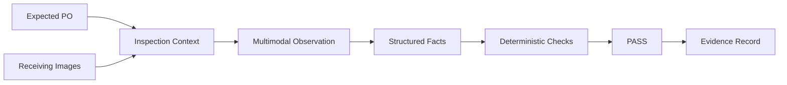

The important condition is that the evidence must actually establish the relevant checks.

---

# 44. Data flow for a confirmed exception

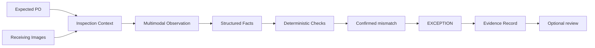

---

# 45. Data flow for uncertainty

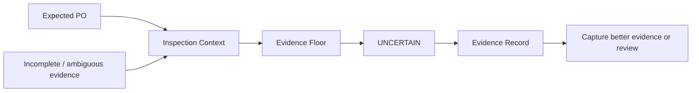

This path is intentional rather than an error condition.

---

# 46. Data flow for model outage

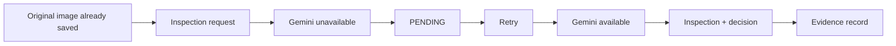

The original image does not need to be uploaded again.

---

# 47. Deployment architecture

The prototype can be deployed as a Next.js application with external managed services:

```mermaid
flowchart TB
    USER[Browser]
    HOST[Next.js Hosting]
    SUP[Supabase]
    GEM[Gemini API]

    USER --> HOST
    HOST --> SUP
    HOST --> GEM
```

The application itself remains portable because its core boundaries are standard:

```text
Next.js
PostgreSQL
Object storage
HTTP API
Gemini API
```

The UI generator used during development is not a runtime dependency.

---

# 48. Configuration architecture

Runtime configuration is supplied through environment variables.

The current repository documents configuration through:

```text
.env.example
```

Important values include:

```text
NEXT_PUBLIC_SUPABASE_URL
NEXT_PUBLIC_SUPABASE_ANON_KEY
SUPABASE_SERVICE_ROLE_KEY

GEMINI_API_KEY
GEMINI_MODEL

SUPABASE_STORAGE_BUCKET
SEED_DEMO_PASSWORD
```

Sensitive values are not intended to be committed to Git.

---

# 49. Local versus remote processing

The architecture intentionally uses both local/browser and remote processing where each is appropriate.

### Local/browser-side

```text
Image quality
OCR
Barcode detection
```

### Server-side

```text
Authenticated database access
Evidence persistence
Inspection orchestration
Gemini API calls
Decision logic
Evidence building
```

This keeps secrets and authoritative business logic away from the browser while avoiding an unnecessary remote dependency for lightweight supporting signals.

---

# 50. Performance architecture

The main performance-sensitive stages are:

```text
Image upload
OCR
Barcode processing
Gemini inference
Database writes
```

The design addresses these by:

- saving evidence before enrichment
- keeping OCR/barcode as supporting signals
- using one multimodal model call per receiving unit
- recording inspection latency
- persisting the original capture independently from model processing

The current prototype is not described as a benchmarked high-throughput warehouse system. Its architecture leaves room for later queueing and background processing without changing the core evidence contract.

---

# 51. Scaling path

The current synchronous prototype can evolve into a queued processing architecture.

Current:

```text
Browser
  ↓
API
  ↓
Inspect
  ↓
Gemini
  ↓
Persist result
```

Possible future production architecture:

```text
Browser
  ↓
API
  ↓
Queue
  ↓
Worker
  ├── image processing
  ├── Gemini inspection
  ├── decision engine
  └── evidence persistence
  ↓
Status update
  ↓
Review UI
```

The reason this is feasible is that the receiving evidence is already persisted before inspection.

---

# 52. Multi-image inspection strategy

The unit of inspection is the receiving record, not the individual image.

Conceptually:

```text
Receiving record
     ├── overview image
     ├── label image
     ├── quantity image
     ├── product image
     └── optional damage image
             ↓
      One inspection context
             ↓
      One multimodal call
             ↓
      Multiple check results
```

This prevents the model from seeing isolated fragments of the same receiving event without the common PO context.

---

# 53. Traceability architecture

The complete trace chain is:

```text
PO
 ↓
Receiving record
 ↓
Image
 ↓
Supporting signals
 ↓
Model observation
 ↓
Check
 ↓
Decision
 ↓
Evidence
 ↓
Override
 ↓
JSON
```

A reviewer should be able to move backwards through this chain when asking:

> Why did the system make this receiving decision?

---

# 54. Architectural invariants

The following rules define the architecture and should remain true as the project evolves.

### Invariant 1

**Original receiving evidence is persisted before enrichment.**

### Invariant 2

**AI output is structured before business reconciliation.**

### Invariant 3

**PASS and FAIL require sufficient evidence; otherwise the result can remain UNCERTAIN.**

### Invariant 4

**A model/service failure does not imply a product mismatch.**

### Invariant 5

**A human override does not erase the original automated result.**

### Invariant 6

**The model is called once per receiving unit for the inspection workflow rather than once per individual check.**

### Invariant 7

**API keys and privileged database credentials do not belong in the browser.**

### Invariant 8

**Evidence records remain connected to their receiving context.**

### Invariant 9

**No observation is invented to fill an evidence gap.**

---

# 55. Main trade-offs

## Multimodal model versus traditional computer vision

A multimodal model handles changing packaging layouts and diverse visual evidence more flexibly than a large collection of fixed image rules.

Trade-off:

```text
+ flexible visual interpretation
+ simpler support for varied layouts
- external inference dependency
- latency
- model uncertainty
```

---

## One model call versus one call per check

One call per unit provides one shared visual context.

Trade-off:

```text
+ fewer inference calls
+ shared context across checks
+ simpler orchestration
- one call contains more work
- a failure affects the unit's whole inspection attempt
```

The evidence is still preserved, and the call can be retried.

---

## Deterministic rules versus end-to-end LLM judgment

Deterministic reconciliation adds explicit code.

Trade-off:

```text
+ testable
+ auditable
+ predictable
+ easier to reason about
- more application logic
- some visual edge cases still need model interpretation
```

For a receiving workflow, this explicitness is valuable.

---

# 56. Why evidence is a first-class architectural object

Many image-AI applications are organized around:

```text
Image → Answer
```

Receiving Manager is organized around:

```text
Expected state
      +
Physical evidence
      +
Observation
      +
Decision
      +
Audit trail
```

This is a different architecture because the output is not just an answer.

The output is a defensible record.

---

# 57. What the architecture deliberately does not do

The current architecture does not attempt to become a complete WMS or ERP.

It does not require:

- a multi-agent planner
- a general-purpose chatbot
- a separate model call for each check
- a proprietary runtime
- automatic acceptance of uncertain evidence
- hidden decision rules inside free-form model text

The scope remains the receiving inspection decision.

---

# 58. Extension points

The architecture leaves clear places for future additions.

## ERP / WMS integration

Replace or extend PO retrieval/import without changing the inspection boundary.

```text
ERP/WMS
   ↓
PO context
   ↓
same inspection pipeline
```

## Mobile capture

Reuse the same API/evidence contract with a mobile-first capture client.

## Background jobs

Move inspection execution from synchronous API processing to workers.

## Better barcode-first verification

Promote barcode evidence to a stronger deterministic identity signal when available.

## Historical analytics

Use the evidence records to analyze supplier, SKU, site, and recurring exception patterns.

## Continuous evaluation

Add newly human-reviewed records back into the evaluation dataset.

---

# 59. Architecture reviewer checklist

A reviewer can understand the implementation by checking these boundaries in order:

```text
1. Where does the expected PO state come from?
2. Where are original receiving images persisted?
3. Where are image-quality/OCR/barcode signals produced?
4. Where is the Gemini call made?
5. Where is its response structurally validated?
6. Where are PASS / FAIL / UNCERTAIN decided?
7. Where is the evidence floor enforced?
8. Where is the overall outcome computed?
9. Where is the evidence record built?
10. Where are human overrides persisted?
11. Where is the structured JSON exposed?
12. Where are database/storage/auth boundaries enforced?
```

The corresponding source areas are:

```text
PO:
src/lib/po/
src/app/api/purchase-orders/

Evidence:
src/app/api/receiving/[id]/images/
src/lib/evidence/
src/lib/image/

AI:
src/lib/ai/

Inspection:
src/lib/inspection/

Receiving orchestration:
src/lib/server/receiving.ts

Persistence:
src/lib/supabase/
supabase/migrations/

Review:
src/app/api/receiving/[id]/override/
```

---

# 60. Architecture summary

The complete architecture can be reduced to five stages:

```mermaid
flowchart LR
    A[EXPECT<br/>PO + product context]
    B[CAPTURE<br/>Guided receiving evidence]
    C[OBSERVE<br/>Gemini + supporting signals]
    D[DECIDE<br/>Evidence floor + deterministic checks]
    E[PROVE<br/>Evidence record + review]

    A --> B --> C --> D --> E
```

And the core principle remains:

```text
                   ┌───────────────┐
                   │      AI       │
                   │    OBSERVES   │
                   └───────┬───────┘
                           │
                           ▼
                   ┌───────────────┐
                   │    CODE       │
                   │    DECIDES    │
                   └───────┬───────┘
                           │
                           ▼
                   ┌───────────────┐
                   │   EVIDENCE    │
                   │   EXPLAINS    │
                   └───────────────┘
```

Receiving Manager is therefore designed less like a chatbot and more like an evidence-processing system:

```text
What was expected?
        ↓
What was actually captured?
        ↓
What can be observed?
        ↓
What can be proven?
        ↓
What is the resulting decision?
        ↓
Can another person audit it?
```

That is the architectural contract the rest of the project should preserve.
