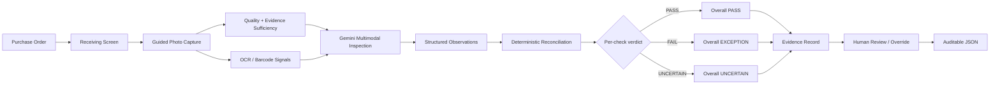
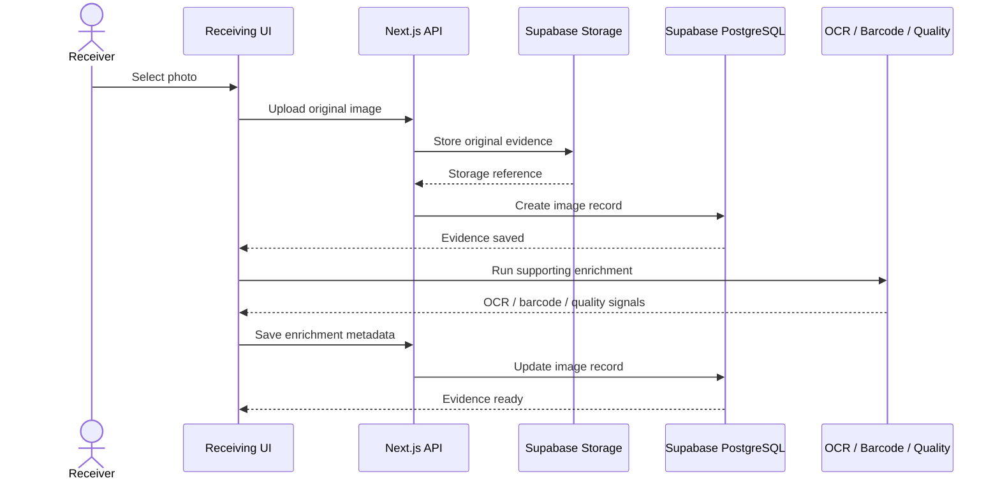
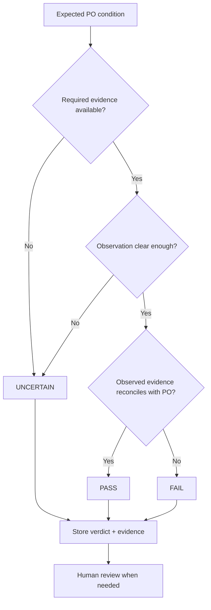
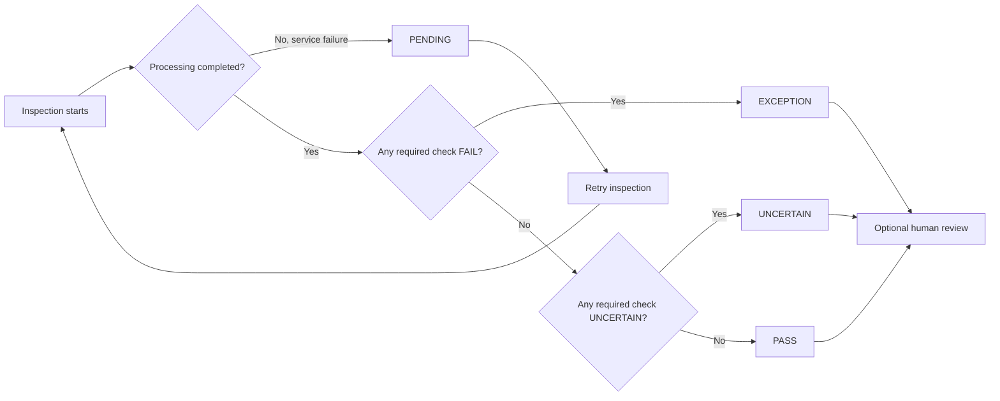
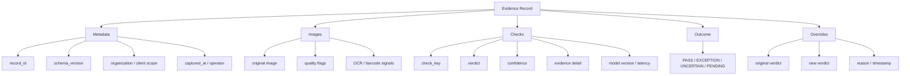
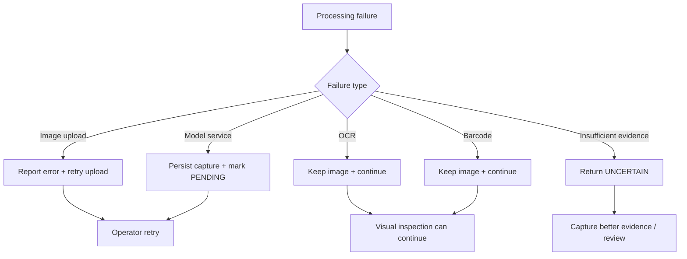
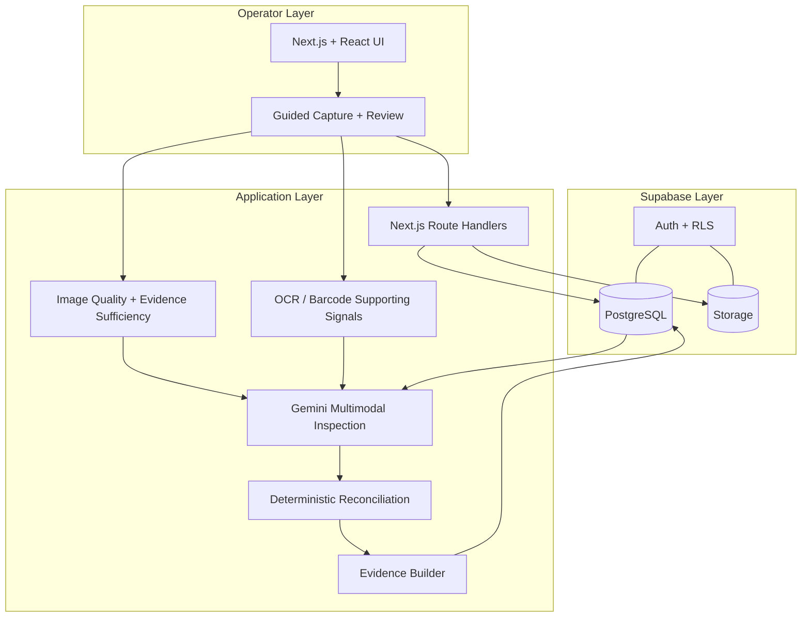
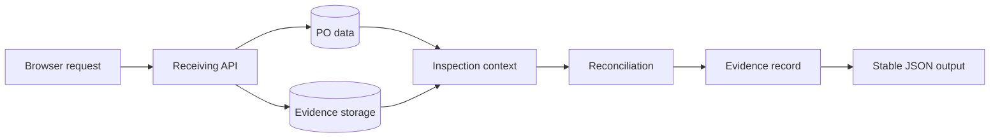

# Receiving Manager

## Verify what actually arrived.

Receiving teams are often forced to make a simple decision with incomplete information:

**Did the shipment that arrived actually match the purchase order?**

Receiving Manager turns that manual check into an evidence-backed visual inspection workflow. An operator selects the expected PO line, captures a small set of guided photos, and the system compares what is visible in those photos with what was ordered.

The important part is not just the final decision. The system keeps the evidence, the individual checks, confidence, model information, timestamps and human overrides together so that a reviewer can understand **why** a shipment was accepted, rejected, or left uncertain.

> **AI observes. Deterministic checks decide. Evidence explains.**

## System overview



The core boundary is deliberate: **AI observes; deterministic application logic decides; the evidence record explains the result.**

---

---

## 1. The problem

A purchase order can tell a receiver what should arrive, but it cannot tell them what is physically in front of them.

In a real receiving workflow, an operator may need to verify:

- Is this the expected product?
- Is the SKU or identifying information consistent with the PO?
- Did the expected number of cartons arrive?
- Is the visible quantity consistent with the order?
- Is the product/unit identity consistent with the expected item?
- Is there visible damage?
- Is the available photo evidence actually sufficient to make the decision?

Doing these checks manually from multiple photos is slow and inconsistent. At the same time, a fully automatic system should not pretend that an unclear image proves something that it does not.

That is why this project treats **UNCERTAIN as a real outcome**, not as a weak PASS.

---

## 2. What Receiving Manager does

The workflow is deliberately focused:

```text
Select PO line
      ↓
Guided photo capture
      ↓
Evidence quality checks
      ↓
OCR / barcode supporting signals
      ↓
Multimodal inspection
      ↓
Structured observations
      ↓
Deterministic reconciliation
      ↓
Per-check PASS / FAIL / UNCERTAIN
      ↓
Overall PASS / EXCEPTION / UNCERTAIN
      ↓
Evidence record
      ↓
Human review / override
```

The system does not ask an LLM to make every business decision directly.

Instead:

1. The model extracts observations from the visual evidence.
2. Application code reconciles those observations against the purchase order.
3. Evidence sufficiency determines when a check cannot be established.
4. The final record stores both the decision and the evidence behind it.

This separation makes the result easier to inspect, test and audit.

---

# 3. Core workflow

## Step 1 — Select the expected item

The receiver selects a purchase-order line.

The interface shows the expected information, including:

- PO number
- supplier
- SKU
- product title
- unit ID when available
- ordered cartons
- units per carton
- total ordered units

This gives the inspection agent a concrete expected state before it looks at the shipment.

---

## Step 2 — Capture guided evidence

The receiving screen uses guided capture types instead of asking for one random photograph.

The operator can provide views such as:

- Overview
- Carton label
- Quantity
- Product
- Optional damage evidence

Each view has a purpose.

For example, a product photo can help establish visual identity, while a carton-label photo can provide text or barcode evidence.

The system also tracks which required views have been captured.

---

## Step 3 — Save the evidence first

A key reliability decision in the implementation is that the original image is uploaded before expensive browser-side enrichment.

The capture flow is:

```text
Image selected
      ↓
Immediate evidence upload
      ↓
Image safely stored
      ↓
OCR / barcode / quality enrichment
```

This means a slow OCR operation or browser-side image analysis cannot make the primary evidence disappear.

If enrichment fails, the original capture remains available for inspection.

### Evidence capture sequence



**Save first, enrich second.** This protects the original evidence from being lost because a local enrichment step is slow or unavailable.

---

---

# 4. Visual inspection

The inspection agent receives the PO expectation together with the available evidence.

The system uses one multimodal model call for the unit rather than making a separate model request for every individual check.

The model is used for visual observation such as:

- visible product identity
- visible labels and identifiers
- visible quantity evidence
- packaging state
- visible damage
- whether the evidence supports a particular observation

OCR and barcode detection are treated as **supporting signals**, not as unquestioned truth.

---

# 5. Decision model

The application separates observations from decisions.

For each check the result can be:

### PASS

There is sufficient evidence supporting the expected condition.

### FAIL

There is sufficient evidence showing that the expected condition is not met.

### UNCERTAIN

The available evidence is insufficient or ambiguous.

This distinction is important.

For example, if a carton label is too blurry to read, the system should not convert that into:

> "SKU matches."

It should preserve the uncertainty.

---

### Decision logic



This keeps **missing or ambiguous evidence separate from a confirmed mismatch**.

---

# 6. Overall outcome

The inspection produces an overall outcome based on the individual checks and evidence sufficiency.

Possible operational states include:

```text
PASS
EXCEPTION
UNCERTAIN
PENDING
```

`PENDING` is used for operational situations such as a model-service failure where the capture has already been saved and the inspection can be retried.

The important property is that a temporary model failure does not destroy the receiving record.

---

### Overall outcome flow



`PENDING` is an operational processing state; `EXCEPTION` is a receiving decision. Keeping those paths separate makes failures easier to retry and audit.

---

# 7. Evidence and traceability

Every inspection is designed to leave behind a traceable evidence record.

The record can contain information such as:

- record ID
- schema version
- organization/client scope
- inspection subject
- capture timestamp
- operator information
- image references
- individual checks
- verdict
- confidence
- explanation/detail
- model version
- latency
- overall outcome
- overrides
- status
- content hash

The application also provides a JSON representation of the evidence record.

This makes the inspection result usable beyond the UI.

---

### Evidence record map



The result is not just a verdict. It is a record connecting **what was captured, what was observed, what was decided, and what a human changed later**.

---

# 8. Human review and overrides

Automation is not treated as irreversible.

A reviewer can inspect the evidence and override a decision when required.

The original decision is not silently erased.

The goal is to preserve an audit trail containing:

```text
Original verdict
      ↓
Reviewer decision
      ↓
Reason
      ↓
Timestamp
```

This is especially important for operational workflows where the final responsibility remains with a human operator.

---

# 9. Failure handling

The application is designed around the idea that external services can fail.

### Image upload failure

The UI reports the upload failure instead of pretending that the evidence was saved.

### OCR failure

OCR is supporting evidence. The inspection can continue without it.

### Barcode detection failure

Barcode detection is supporting evidence. The image itself remains available.

### Model service failure

The capture is preserved and the inspection can enter a retryable/pending state.

### Missing evidence

The system does not invent observations. Affected checks can become `UNCERTAIN`.

This gives the workflow a safer failure mode than silently producing a confident answer from incomplete evidence.

---

### Failure handling map



The intended behavior is **fail safely, preserve evidence, and make the next action visible**.

---

# 10. Why the system uses AI

The visual part of receiving inspection is difficult to encode entirely with fixed rules.

Images can contain:

- different packaging layouts
- different lighting
- text in different positions
- multiple cartons
- partially visible products
- labels at different angles
- visually similar products

A multimodal model is useful for extracting structured observations from those images.

But the model is **not the complete business-rule engine**.

The architecture intentionally follows:

```text
AI → observation

Code → reconciliation

Evidence layer → traceability
```

That makes the role of AI specific and measurable.

---

# 11. Architecture

### Architecture layers



The model does not write the final business verdict directly. Its output is reconciled with the expected PO state before the result is persisted.

```text
                         ┌──────────────────────┐
                         │     Receiving UI     │
                         │   Next.js + React     │
                         └──────────┬───────────┘
                                    │
                                    ▼
                         ┌──────────────────────┐
                         │   Receiving API      │
                         │ Next.js Route Handlers│
                         └──────────┬───────────┘
                                    │
                    ┌───────────────┼────────────────┐
                    │               │                │
                    ▼               ▼                ▼
             ┌───────────┐   ┌────────────┐   ┌─────────────┐
             │ Supabase  │   │ Image      │   │ PO / Rules  │
             │ DB + Auth │   │ Storage    │   │ Reconciliation│
             └───────────┘   └────────────┘   └─────────────┘
                                    │
                                    ▼
                         ┌──────────────────────┐
                         │ Supporting Signals   │
                         │ OCR / Barcode /      │
                         │ Image Quality        │
                         └──────────┬───────────┘
                                    │
                                    ▼
                         ┌──────────────────────┐
                         │ Gemini Multimodal    │
                         │ Vision Inspection    │
                         └──────────┬───────────┘
                                    │
                                    ▼
                         ┌──────────────────────┐
                         │ Structured Facts     │
                         │ + Zod validation     │
                         └──────────┬───────────┘
                                    │
                                    ▼
                         ┌──────────────────────┐
                         │ Deterministic        │
                         │ Decision Engine      │
                         └──────────┬───────────┘
                                    │
                                    ▼
                         ┌──────────────────────┐
                         │ Evidence Record      │
                         │ PASS / FAIL /        │
                         │ UNCERTAIN / PENDING  │
                         └──────────────────────┘
```

For a more detailed breakdown, see [`ARCHITECTURE.md`](./ARCHITECTURE.md).

---

# 12. Technology stack

### Frontend

- Next.js
- React
- TypeScript
- Tailwind CSS
- Lucide icons

### Backend

- Next.js Route Handlers
- TypeScript
- Zod validation

### Database and storage

- Supabase PostgreSQL
- Supabase Storage
- Supabase Auth
- Row-level security

### Vision / AI

- Google Gemini multimodal API
- Structured JSON output
- Gemini 3.8 Flash configured as the primary model

### Local supporting signals

- Tesseract.js for OCR
- ZXing for barcode detection
- Browser-side image quality analysis

### Evaluation

- Python
- pandas
- scikit-learn
- Vitest for application tests

---

# 13. Security and isolation

The project is designed with organization/client isolation in mind.

Important implementation points include:

- authenticated application access
- server-side privileged Supabase operations
- organization/client scoping
- private evidence storage
- server-side API validation
- no API keys in the client
- environment variables for secrets
- evidence records scoped to the receiving context
- audit-preserving overrides

The `.env.local` file is intentionally excluded from Git.

Only `.env.example` is included in the repository.

---

# 14. Local setup

## Requirements

- Node.js 20+
- npm
- Supabase project
- Gemini API key

Clone the repository:

```bash
git clone https://github.com/GURUTEJGANAPURAPU/cube26-rcv-0155-gurutejganapurapu.git
cd cube26-rcv-0155-gurutejganapurapu
```

Install dependencies:

```bash
npm install
```

Create the environment file:

```bash
cp .env.example .env.local
```

On Windows, you can simply create `.env.local` manually from `.env.example`.

Configure the required environment variables.

Then start the application:

```bash
npm run dev
```

Open:

```text
http://localhost:3000
```

---

# 15. Environment variables

The repository contains `.env.example` as the configuration reference.

Typical configuration includes:

```env
NEXT_PUBLIC_SUPABASE_URL=
NEXT_PUBLIC_SUPABASE_ANON_KEY=
SUPABASE_SERVICE_ROLE_KEY=

GEMINI_API_KEY=
GEMINI_MODEL=gemini-3.8-flash

SUPABASE_STORAGE_BUCKET=receiving-evidence

SEED_DEMO_PASSWORD=
```

Never commit real API keys or service-role credentials.

---

# 16. Demo data

The project includes a demo seeding workflow so the receiving flow can be demonstrated without depending on a live enterprise ERP.

The demo data is synthetic and clearly marked as DEMO.

The seed workflow creates purchase orders and receiving-related reference data for testing the complete flow.

---

# 17. Demo flow

A concise demonstration can follow this sequence:

### 1. Sign in

Enter the receiving application.

### 2. Select a PO line

Show the expected:

- SKU
- product
- cartons
- units
- supplier

### 3. Capture evidence

Add the guided images.

The application saves the images before running enrichment.

### 4. Inspect

Start the receiving inspection.

### 5. Show the decision

The evidence screen displays the individual checks and their verdicts.

### 6. Open evidence

Show the captured images and decision details.

### 7. Open JSON

Show that the result is not just a UI message; it is a structured evidence record.

### 8. Demonstrate uncertainty / exception handling

Show that the system can distinguish a confirmed mismatch from an evidence gap instead of forcing every situation into PASS or FAIL.

---

# 18. What makes the approach different

The goal was not to build another generic "upload an image and ask AI what it sees" application.

The receiving problem has three separate concerns:

```text
What was ordered?
        +
What can actually be observed?
        +
What can be proven from the evidence?
```

Receiving Manager keeps those concerns separate.

The purchase order provides the expectation.

The photographs provide the physical evidence.

The multimodal model extracts observations.

The decision layer reconciles the observations against the expectation.

The evidence layer records how the decision was reached.

That separation is the core design choice.

---

# 19. Important engineering decisions

## One model call per receiving unit

The model receives the available evidence for the unit together with the expected PO information.

This avoids making a separate expensive model call for every individual check.

## Evidence first

An uploaded image should not disappear because OCR or image processing is slow.

## UNCERTAIN is first-class

Missing or ambiguous evidence should remain uncertain.

## Deterministic reconciliation

Business rules should not depend entirely on free-form model reasoning.

## Auditable overrides

Human intervention should add to the record rather than erase the original automated decision.

## Retryable model failures

Temporary AI-service problems should not destroy the receiving capture.

---

# 20. Evaluation

The repository includes an evaluation workflow under:

```text
evaluation/
```

and application tests under:

```text
tests/
```

The evaluation approach focuses on:

- per-check performance
- false positives
- false negatives
- UNCERTAIN behaviour
- evidence sufficiency
- failure modes
- latency
- model/service failures
- decision traceability

The project does **not** claim an accuracy number without running the corresponding evaluation.

See:

- [`EVALUATION.md`](./EVALUATION.md)
- [`evaluation/`](./evaluation/)
- [`tests/`](./tests/)

---

# 21. Current limitations

This is a hackathon implementation, not a finished warehouse management system.

Current limitations include:

- camera/image quality can affect visual verification
- OCR is supporting evidence and can make mistakes
- barcode detection depends on image quality and barcode visibility
- visually similar products can remain uncertain
- quantity verification is constrained by what is actually visible in the captured evidence
- external model availability can affect inspection latency
- real enterprise deployment would require ERP/WMS integration and stronger operational controls

These limitations are intentionally surfaced instead of hidden behind a confident AI response.

---

# 22. Future improvements

If this moves beyond the prototype, the next improvements would be:

### ERP / WMS integration

Read PO and receiving records directly from enterprise systems.

### Mobile receiving mode

Optimize the guided capture workflow for warehouse operators using a phone.

### Better quantity verification

Use multi-image counting and stronger scene-level reasoning for cartons and units.

### Barcode-first identification

Use barcode and OCR evidence as stronger deterministic identity signals when available.

### Review queue

Route uncertain and exception cases to a human reviewer.

### Historical analytics

Track recurring receiving exceptions by supplier, SKU, location and time.

### Model evaluation dashboard

Continuously measure model behaviour against newly reviewed receiving cases.

### Operational observability

Track latency, failures, retries, model versions and service availability.

---

# 23. Repository structure

```text
.
├── .github/
├── data/
├── docs/
├── evaluation/
├── scripts/
├── src/
│   ├── app/
│   │   ├── (app)/
│   │   ├── api/
│   │   └── sign-in/
│   ├── components/
│   └── lib/
│       ├── ai/
│       ├── barcode/
│       ├── evidence/
│       ├── image/
│       ├── inspection/
│       ├── ocr/
│       ├── po/
│       ├── server/
│       └── supabase/
├── supabase/
├── tests/
├── ARCHITECTURE.md
├── EVALUATION.md
├── package.json
└── README.md
```

---

### Request-to-record flow



Each stage has a clear responsibility, which also makes the workflow easier to test and debug.

# 24. Design principle

The project can be summarized in one sentence:

> **A receiving inspection system should not only tell an operator what it thinks arrived; it should show what was observed, what was verified, what remains uncertain, and why the final decision was made.**

That is the reason Receiving Manager is built around **evidence, uncertainty and traceability**, rather than simply generating an AI answer.

---

## Status

**Track:** Receiving Manager — Verify what actually arrived

**Build status:** Working end-to-end prototype

**Primary workflow:** PO → guided capture → evidence → visual inspection → deterministic checks → decision → evidence JSON

**Primary model:** Gemini multimodal

**Storage:** Supabase

**Application:** Next.js + TypeScript

**Repository:** [GURUTEJGANAPURAPU/cube26-rcv-0155-gurutejganapurapu](https://github.com/GURUTEJGANAPURAPU/cube26-rcv-0155-gurutejganapurapu)

---

## Final note

It does not try to become a complete warehouse management platform.

It focuses on one operational question:

> **"What actually arrived, and what evidence do we have to support that decision?"**

Everything in the implementation is built around answering that question reliably.
